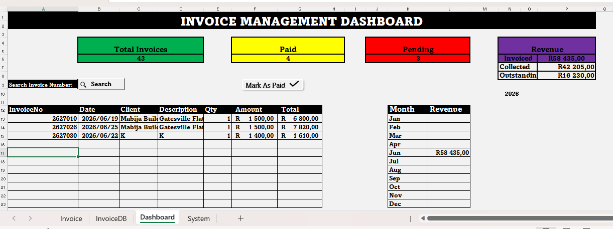
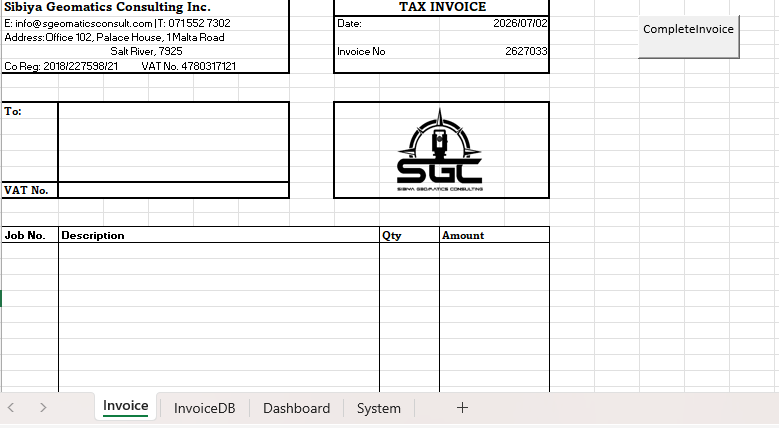
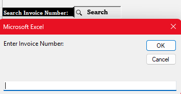
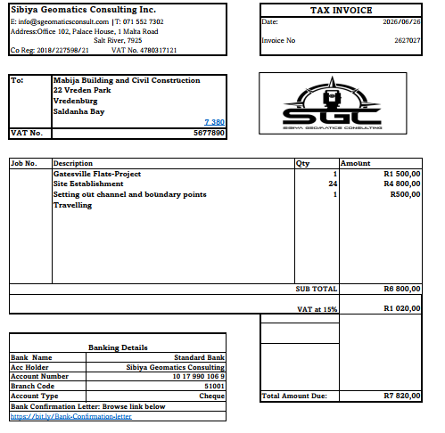

# excel-invoice-management-system
Custom Invoice Management System built with Microsoft Excel VBA for a Geomatics company.
# Invoice Management System

## Overview

This project is a custom Invoice Management System developed using Microsoft Excel and VBA for a geomatics company.

It automates invoice creation, PDF generation, payment tracking, and dashboard reporting.

---

## Features

- Automatic Invoice Numbering
- PDF Export
- Invoice Database
- Search Invoice
- Dashboard
- Revenue Tracking
- Payment Tracking

---

## Technologies

- Microsoft Excel
- VBA
- Excel Tables
- Dashboard Design

---

## Screenshots

### Dashboard

### Invoice Form

### Search Invoice

### Generated PDF

---

## Author

**Ntokozo Vundla**

Bachelor of Science in Computer Science and Mathematics
